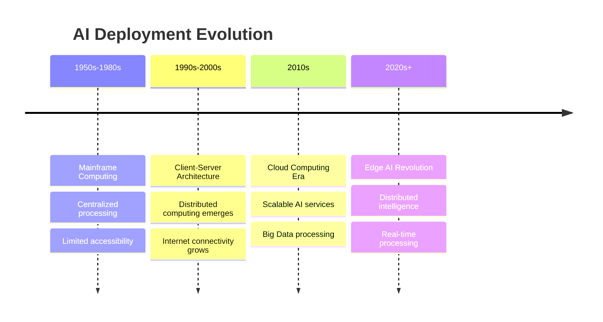

# Introduction to EdgeAI

EdgeAI represents a fundamental shift in how we deploy and execute artificial intelligence, moving computation from centralized cloud servers to distributed edge devices. This paradigm enables intelligent processing at the source of data generation, revolutionizing applications across industries.

## Historical Context

### Evolution of AI Deployment



## Core Concepts

### 1. Edge Computing Fundamentals

**Edge computing** brings computation and data storage closer to data sources, reducing latency and bandwidth usage. Key characteristics include:

| Characteristic | Traditional Cloud | Edge Computing |
|----------------|------------------|----------------|
| **Latency** | 50-200ms | <10ms |
| **Bandwidth** | High requirement | Minimal |
| **Privacy** | Data leaves device | Data stays local |
| **Reliability** | Internet dependent | Offline capable |
| **Scalability** | Centralized scaling | Distributed scaling |

### 2. Artificial Intelligence at the Edge

EdgeAI combines edge computing with machine learning capabilities, enabling:

- **Real-time inference** on local devices
- **Adaptive learning** from local data patterns
- **Federated learning** across edge networks
- **Autonomous decision-making** without cloud connectivity

## Technical Architecture

### EdgeAI System Components

```python
class EdgeAISystem:
    def __init__(self):
        self.sensors = SensorArray()
        self.preprocessor = DataPreprocessor()
        self.ai_accelerator = NPU()  # Neural Processing Unit
        self.inference_engine = InferenceEngine()
        self.edge_gateway = EdgeGateway()
        self.cloud_connector = CloudConnector()
    
    def process_data(self, raw_data):
        # Local preprocessing
        processed_data = self.preprocessor.clean(raw_data)
        
        # Edge inference
        predictions = self.inference_engine.predict(processed_data)
        
        # Local decision making
        if predictions.confidence > 0.95:
            return self.execute_local_action(predictions)
        else:
            return self.escalate_to_cloud(processed_data)
```

### Data Flow Architecture


## Key Technologies

### 1. Model Optimization Techniques

#### Quantization
Reduces model precision from 32-bit to 8-bit or lower:

```python
import tensorflow as tf

# Post-training quantization
converter = tf.lite.TFLiteConverter.from_saved_model('model_path')
converter.optimizations = [tf.lite.Optimize.DEFAULT]
converter.target_spec.supported_types = [tf.int8]

# Quantized model
quantized_model = converter.convert()

# Size reduction: ~75%
# Speed improvement: 2-4x
# Accuracy loss: <2%
```

#### Model Pruning
Removes unnecessary neural network connections:

```python
import tensorflow_model_optimization as tfmot

# Structured pruning
pruning_params = {
    'pruning_schedule': tfmot.sparsity.keras.PolynomialDecay(
        initial_sparsity=0.0,
        final_sparsity=0.5,
        begin_step=1000,
        end_step=5000
    )
}

model = tfmot.sparsity.keras.prune_low_magnitude(model, **pruning_params)
```

### 2. Hardware Acceleration

| Technology | Description | Use Cases | Performance |
|------------|-------------|-----------|-------------|
| **NPU** | Neural Processing Units | Computer vision, NLP | 1-100 TOPS |
| **GPU** | Graphics Processing Units | Deep learning training/inference | 10-300 TFLOPS |
| **FPGA** | Field-Programmable Gate Arrays | Custom acceleration | Configurable |
| **ASIC** | Application-Specific ICs | Specialized tasks | Ultra-efficient |

## EdgeAI vs Cloud AI Comparison

### Performance Metrics

```python
# Latency comparison example
import time
import requests

def cloud_inference(data):
    start_time = time.time()
    response = requests.post('https://api.cloud-ai.com/predict', json=data)
    end_time = time.time()
    return response.json(), (end_time - start_time) * 1000

def edge_inference(data):
    start_time = time.time()
    # Local model inference
    result = local_model.predict(data)
    end_time = time.time()
    return result, (end_time - start_time) * 1000

# Typical results:
# Cloud inference: 150-300ms
# Edge inference: 5-50ms
```

### Cost Analysis

| Factor | Cloud AI | Edge AI |
|--------|----------|---------|
| **Initial Setup** | Low ($0-100) | High ($500-5000) |
| **Operational Cost** | High (per API call) | Low (electricity only) |
| **Bandwidth Cost** | High | Minimal |
| **Scaling Cost** | Linear with usage | One-time hardware |
| **5-Year TCO** | $50,000-500,000 | $10,000-50,000 |

## Application Domains

### 1. Computer Vision
- **Object Detection**: Real-time identification of objects in video streams
- **Facial Recognition**: Identity verification at access points
- **Quality Control**: Manufacturing defect detection
- **Medical Imaging**: Diagnostic assistance in healthcare

### 2. Natural Language Processing
- **Voice Assistants**: Offline speech recognition and response
- **Language Translation**: Real-time multilingual communication
- **Sentiment Analysis**: Customer feedback processing
- **Text Summarization**: Document processing at the edge

### 3. Predictive Analytics
- **Predictive Maintenance**: Equipment failure prediction
- **Anomaly Detection**: Security and fraud detection
- **Demand Forecasting**: Inventory optimization
- **Risk Assessment**: Financial and insurance applications

## Challenges and Limitations

### Technical Challenges

| Challenge | Description | Solutions |
|-----------|-------------|-----------|
| **Resource Constraints** | Limited compute, memory, power | Model optimization, efficient architectures |
| **Model Accuracy** | Compressed models may lose accuracy | Advanced compression techniques, ensemble methods |
| **Hardware Heterogeneity** | Different edge devices, capabilities | Standardized frameworks, adaptive deployment |
| **Update Management** | Deploying model updates to edge devices | OTA updates, federated learning |

### Code Example: Resource Monitoring

```python
import psutil
import time

class EdgeResourceMonitor:
    def __init__(self):
        self.cpu_threshold = 80.0  # %
        self.memory_threshold = 85.0  # %
        self.temperature_threshold = 70.0  # °C
    
    def monitor_resources(self):
        while True:
            # CPU usage
            cpu_percent = psutil.cpu_percent(interval=1)
            
            # Memory usage
            memory = psutil.virtual_memory()
            memory_percent = memory.percent
            
            # Temperature (if available)
            try:
                temps = psutil.sensors_temperatures()
                cpu_temp = temps['cpu_thermal'][0].current
            except:
                cpu_temp = 0
            
            # Adaptive model selection based on resources
            if cpu_percent > self.cpu_threshold:
                self.switch_to_lightweight_model()
            elif memory_percent > self.memory_threshold:
                self.reduce_batch_size()
            
            time.sleep(5)
    
    def switch_to_lightweight_model(self):
        print("Switching to lightweight model due to high CPU usage")
        # Implementation for model switching
        pass
```

## Future Directions

### Emerging Trends

1. **Neuromorphic Computing**: Brain-inspired computing architectures
2. **Quantum Edge Computing**: Quantum algorithms for edge devices
3. **5G Integration**: Ultra-low latency edge computing with 5G networks
4. **Federated Learning**: Collaborative learning across edge devices
5. **AutoML for Edge**: Automated machine learning model optimization

### Research Areas

- **Energy-Efficient AI**: Reducing power consumption for battery-powered devices
- **Continual Learning**: Models that adapt and learn continuously at the edge
- **Privacy-Preserving AI**: Techniques for maintaining privacy in distributed systems
- **Edge-Cloud Orchestration**: Optimal workload distribution between edge and cloud

## Getting Started Checklist

- [ ] Understand your use case requirements (latency, accuracy, power)
- [ ] Select appropriate hardware platform
- [ ] Choose development framework and tools
- [ ] Implement model optimization techniques
- [ ] Design edge-cloud architecture
- [ ] Plan deployment and update strategy
- [ ] Implement monitoring and maintenance procedures

---

*This introduction provides the foundation for understanding EdgeAI concepts. Continue to the [EdgeAI Overview](edgeai-overview.md) for deeper technical details.*
